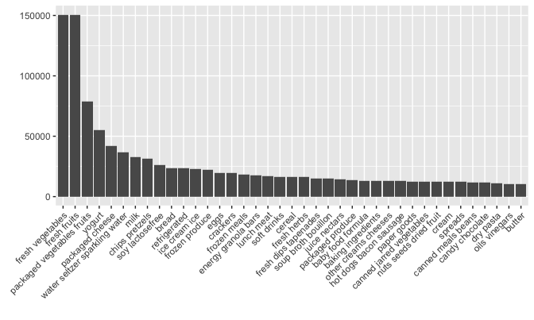
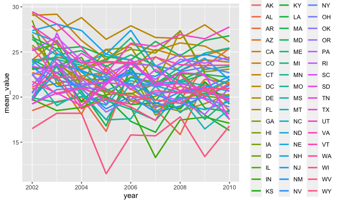
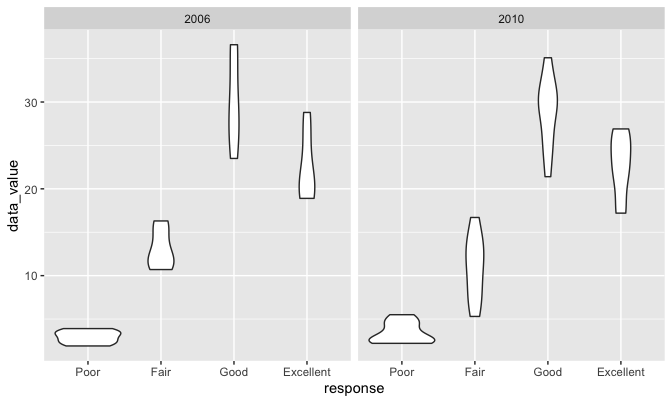
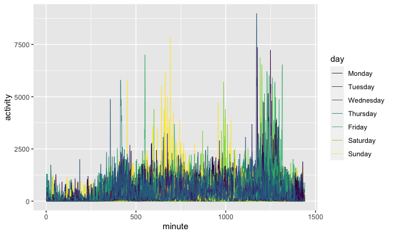

P8105\_HW3
================
Junzhe Shao
10/18/2021

## Problem 1

noting the size and structure of the data, describing some key
variables, and giving illustrative examples of observations.

There are 1384617,and the variables are order\_id, product\_id,
add\_to\_cart\_order, reordered, user\_id, eval\_set, order\_number,
order\_dow, order\_hour\_of\_day, days\_since\_prior\_order,
product\_name, aisle\_id, department\_id, aisle, department, some key
variables here are aisle: the name of the aisle,order\_number: the order
sequence number for this user (1=first, n=nth). Each row in the dataset
is a product from an order

How many aisles are there, and which aisles are the most items ordered
from?

``` r
data("instacart")
#levels(as.factor(instacart$aisle))
aisle_dt <- instacart %>%
  group_by(aisle)%>%
  summarise(n_order = n()) %>% 
  arrange(-n_order)
kable(head(aisle_dt,15), caption = "Top Aisles Orderd from")
```

| aisle                         | n\_order |
|:------------------------------|---------:|
| fresh vegetables              |   150609 |
| fresh fruits                  |   150473 |
| packaged vegetables fruits    |    78493 |
| yogurt                        |    55240 |
| packaged cheese               |    41699 |
| water seltzer sparkling water |    36617 |
| milk                          |    32644 |
| chips pretzels                |    31269 |
| soy lactosefree               |    26240 |
| bread                         |    23635 |
| refrigerated                  |    23228 |
| ice cream ice                 |    22676 |
| frozen produce                |    22453 |
| eggs                          |    19875 |
| crackers                      |    19592 |

Top Aisles Orderd from

There are 134, and the top 15 aisles are listed in the table above.

Make a plot that shows the number of items ordered in each aisle,
limiting this to aisles with more than 10000 items ordered. Arrange
aisles sensibly, and organize your plot so others can read it.

``` r
aisle_dt %>% 
  filter(n_order > 10000) %>% 
  ggplot(aes(x= reorder(aisle,-n_order), y = n_order)) + geom_bar(stat="identity")+theme(axis.text.x = element_text(angle = 45, hjust = 1) )+ labs(x = "",y = "")
```



Make a table showing the three most popular items in each of the aisles
“baking ingredients”, “dog food care”, and “packaged vegetables fruits”.
Include the number of times each item is ordered in your table.

``` r
ordered_dt <- instacart %>% 
  group_by(aisle, product_name) %>% 
  summarise(n_order = n()) %>% 
  mutate(order_ranking = min_rank(-n_order)) %>% 
  filter(order_ranking <= 3) %>% 
  filter(aisle %in% c("baking ingredients", "dog food care","packaged vegetables fruits")) %>% 
  arrange(order_ranking) %>% 
  arrange(aisle)
```

    ## `summarise()` has grouped output by 'aisle'. You can override using the `.groups` argument.

``` r
kable(ordered_dt, caption = "three most popular items in certain aisles")
```

| aisle                      | product\_name                                 | n\_order | order\_ranking |
|:---------------------------|:----------------------------------------------|---------:|---------------:|
| baking ingredients         | Light Brown Sugar                             |      499 |              1 |
| baking ingredients         | Pure Baking Soda                              |      387 |              2 |
| baking ingredients         | Cane Sugar                                    |      336 |              3 |
| dog food care              | Snack Sticks Chicken & Rice Recipe Dog Treats |       30 |              1 |
| dog food care              | Organix Chicken & Brown Rice Recipe           |       28 |              2 |
| dog food care              | Small Dog Biscuits                            |       26 |              3 |
| packaged vegetables fruits | Organic Baby Spinach                          |     9784 |              1 |
| packaged vegetables fruits | Organic Raspberries                           |     5546 |              2 |
| packaged vegetables fruits | Organic Blueberries                           |     4966 |              3 |

three most popular items in certain aisles

Make a table showing the mean hour of the day at which Pink Lady Apples
and Coffee Ice Cream are ordered on each day of the week; format this
table for human readers (i.e. produce a 2 x 7 table).

``` r
weekday_dt <- instacart %>% 
  filter(product_name %in% c("Pink Lady Apples","Coffee Ice Cream") )%>% 
  group_by(product_name,order_dow) %>% 
  summarise(mean_ordered_hour = mean(order_hour_of_day)) %>% 
  pivot_wider(names_from = order_dow, values_from = mean_ordered_hour) %>% 
  janitor::clean_names() %>% 
  rename(Sun = x0, Mon =x1, Tue =x2, Wed =x3, Thu =x4, Fri =x5, Sat =x6)
```

    ## `summarise()` has grouped output by 'product_name'. You can override using the `.groups` argument.

``` r
kable(weekday_dt,caption = "Mean Hour of Day")
```

| product\_name    |      Sun |      Mon |      Tue |      Wed |      Thu |      Fri |      Sat |
|:-----------------|---------:|---------:|---------:|---------:|---------:|---------:|---------:|
| Coffee Ice Cream | 13.77419 | 14.31579 | 15.38095 | 15.31818 | 15.21739 | 12.26316 | 13.83333 |
| Pink Lady Apples | 13.44118 | 11.36000 | 11.70213 | 14.25000 | 11.55172 | 12.78431 | 11.93750 |

Mean Hour of Day

## Problem 2

format the data to use appropriate variable names; focus on the “Overall
Health” topic include only responses from “Excellent” to “Poor” organize
responses as a factor taking levels ordered from “Poor” to “Excellent”

``` r
data("brfss_smart2010")
brfss = brfss_smart2010 %>% 
  filter(Topic == "Overall Health", Response %in% c("Poor", "Fair", "Good", "Very Good", "Excellent")) %>% 
  mutate(Response = factor(Response,ordered = T,levels = c("Poor", "Fair", "Good", "Very Good", "Excellent"))) %>% 
  janitor::clean_names()
kable(head(brfss,15))
```

| year | locationabbr | locationdesc           | class         | topic          | question                    | response  | sample\_size | data\_value | confidence\_limit\_low | confidence\_limit\_high | display\_order | data\_value\_unit | data\_value\_type | data\_value\_footnote\_symbol | data\_value\_footnote | data\_source | class\_id | topic\_id | location\_id | question\_id | respid  | geo\_location           |
|-----:|:-------------|:-----------------------|:--------------|:---------------|:----------------------------|:----------|-------------:|------------:|-----------------------:|------------------------:|---------------:|:------------------|:------------------|:------------------------------|:----------------------|:-------------|:----------|:----------|:-------------|:-------------|:--------|:------------------------|
| 2010 | AL           | AL - Jefferson County  | Health Status | Overall Health | How is your general health? | Excellent |           94 |        18.9 |                   14.1 |                    23.6 |              1 | %                 | Crude Prevalence  | NA                            | NA                    | BRFSS        | CLASS08   | Topic41   | NA           | GENHLTH      | RESP056 | (33.518601, -86.814688) |
| 2010 | AL           | AL - Jefferson County  | Health Status | Overall Health | How is your general health? | Good      |          208 |        33.1 |                   28.2 |                    38.0 |              3 | %                 | Crude Prevalence  | NA                            | NA                    | BRFSS        | CLASS08   | Topic41   | NA           | GENHLTH      | RESP058 | (33.518601, -86.814688) |
| 2010 | AL           | AL - Jefferson County  | Health Status | Overall Health | How is your general health? | Fair      |          107 |        12.5 |                    9.5 |                    15.4 |              4 | %                 | Crude Prevalence  | NA                            | NA                    | BRFSS        | CLASS08   | Topic41   | NA           | GENHLTH      | RESP059 | (33.518601, -86.814688) |
| 2010 | AL           | AL - Jefferson County  | Health Status | Overall Health | How is your general health? | Poor      |           45 |         5.5 |                    3.5 |                     7.4 |              5 | %                 | Crude Prevalence  | NA                            | NA                    | BRFSS        | CLASS08   | Topic41   | NA           | GENHLTH      | RESP060 | (33.518601, -86.814688) |
| 2010 | AL           | AL - Mobile County     | Health Status | Overall Health | How is your general health? | Excellent |           91 |        15.6 |                   11.0 |                    20.1 |              1 | %                 | Crude Prevalence  | NA                            | NA                    | BRFSS        | CLASS08   | Topic41   | NA           | GENHLTH      | RESP056 | (30.683993, -88.170637) |
| 2010 | AL           | AL - Mobile County     | Health Status | Overall Health | How is your general health? | Good      |          224 |        31.2 |                   26.1 |                    36.2 |              3 | %                 | Crude Prevalence  | NA                            | NA                    | BRFSS        | CLASS08   | Topic41   | NA           | GENHLTH      | RESP058 | (30.683993, -88.170637) |
| 2010 | AL           | AL - Mobile County     | Health Status | Overall Health | How is your general health? | Fair      |          120 |        15.5 |                   11.7 |                    19.2 |              4 | %                 | Crude Prevalence  | NA                            | NA                    | BRFSS        | CLASS08   | Topic41   | NA           | GENHLTH      | RESP059 | (30.683993, -88.170637) |
| 2010 | AL           | AL - Mobile County     | Health Status | Overall Health | How is your general health? | Poor      |           66 |         6.4 |                    4.4 |                     8.3 |              5 | %                 | Crude Prevalence  | NA                            | NA                    | BRFSS        | CLASS08   | Topic41   | NA           | GENHLTH      | RESP060 | (30.683993, -88.170637) |
| 2010 | AL           | AL - Tuscaloosa County | Health Status | Overall Health | How is your general health? | Excellent |           58 |        20.8 |                   14.1 |                    27.4 |              1 | %                 | Crude Prevalence  | NA                            | NA                    | BRFSS        | CLASS08   | Topic41   | NA           | GENHLTH      | RESP056 | (33.214154, -87.520229) |
| 2010 | AL           | AL - Tuscaloosa County | Health Status | Overall Health | How is your general health? | Good      |          171 |        33.8 |                   27.7 |                    39.8 |              3 | %                 | Crude Prevalence  | NA                            | NA                    | BRFSS        | CLASS08   | Topic41   | NA           | GENHLTH      | RESP058 | (33.214154, -87.520229) |
| 2010 | AL           | AL - Tuscaloosa County | Health Status | Overall Health | How is your general health? | Fair      |           62 |        11.7 |                    7.3 |                    16.0 |              4 | %                 | Crude Prevalence  | NA                            | NA                    | BRFSS        | CLASS08   | Topic41   | NA           | GENHLTH      | RESP059 | (33.214154, -87.520229) |
| 2010 | AL           | AL - Tuscaloosa County | Health Status | Overall Health | How is your general health? | Poor      |           35 |         4.2 |                    2.6 |                     5.7 |              5 | %                 | Crude Prevalence  | NA                            | NA                    | BRFSS        | CLASS08   | Topic41   | NA           | GENHLTH      | RESP060 | (33.214154, -87.520229) |
| 2010 | AZ           | AZ - Maricopa County   | Health Status | Overall Health | How is your general health? | Excellent |          269 |        27.3 |                   23.3 |                    31.2 |              1 | %                 | Crude Prevalence  | NA                            | NA                    | BRFSS        | CLASS08   | Topic41   | NA           | GENHLTH      | RESP056 | (33.493403, -112.04143) |
| 2010 | AZ           | AZ - Maricopa County   | Health Status | Overall Health | How is your general health? | Good      |          384 |        27.7 |                   24.1 |                    31.2 |              3 | %                 | Crude Prevalence  | NA                            | NA                    | BRFSS        | CLASS08   | Topic41   | NA           | GENHLTH      | RESP058 | (33.493403, -112.04143) |
| 2010 | AZ           | AZ - Maricopa County   | Health Status | Overall Health | How is your general health? | Fair      |          156 |         9.6 |                    7.4 |                    11.7 |              4 | %                 | Crude Prevalence  | NA                            | NA                    | BRFSS        | CLASS08   | Topic41   | NA           | GENHLTH      | RESP059 | (33.493403, -112.04143) |

in 2002, which states were observed at 7 or more locations? What about
in 2010?

``` r
location_dt = brfss %>% 
  group_by(locationabbr, year) %>% 
  summarise(
    n_location = n_distinct(locationdesc)
  ) %>% 
  filter(
    year %in% c(2002,2010),
    n_location >=7
  ) %>% arrange(year)
```

    ## `summarise()` has grouped output by 'locationabbr'. You can override using the `.groups` argument.

``` r
kable(location_dt)
```

| locationabbr | year | n\_location |
|:-------------|-----:|------------:|
| CT           | 2002 |           7 |
| FL           | 2002 |           7 |
| MA           | 2002 |           8 |
| NC           | 2002 |           7 |
| NJ           | 2002 |           8 |
| PA           | 2002 |          10 |
| CA           | 2010 |          12 |
| CO           | 2010 |           7 |
| FL           | 2010 |          41 |
| MA           | 2010 |           9 |
| MD           | 2010 |          12 |
| NC           | 2010 |          12 |
| NE           | 2010 |          10 |
| NJ           | 2010 |          19 |
| NY           | 2010 |           9 |
| OH           | 2010 |           8 |
| PA           | 2010 |           7 |
| SC           | 2010 |           7 |
| TX           | 2010 |          16 |
| WA           | 2010 |          10 |

Construct a dataset that is limited to Excellent responses, and
contains, year, state, and a variable that averages the data\_value
across locations within a state. Make a “spaghetti” plot of this average
value over time within a state (that is, make a plot showing a line for
each state across years – the geom\_line geometry and group aesthetic
will help).

``` r
plot_dt <- brfss %>% 
  filter(response == "Excellent") %>% 
  group_by(year, locationabbr) %>% 
  summarise(
    mean_value = mean(data_value)
  )
```

    ## `summarise()` has grouped output by 'year'. You can override using the `.groups` argument.

``` r
kable(head(plot_dt,10))
```

| year | locationabbr | mean\_value |
|-----:|:-------------|------------:|
| 2002 | AK           |    27.90000 |
| 2002 | AL           |    18.50000 |
| 2002 | AR           |    24.10000 |
| 2002 | AZ           |    24.10000 |
| 2002 | CA           |    22.70000 |
| 2002 | CO           |    23.07500 |
| 2002 | CT           |    29.05714 |
| 2002 | DC           |    29.30000 |
| 2002 | DE           |    20.90000 |
| 2002 | FL           |    25.74286 |

``` r
plot_dt %>% ggplot(aes(x = year, y = mean_value, group = locationabbr, color = locationabbr))+geom_line(size =1)
```

    ## Warning: Removed 3 row(s) containing missing values (geom_path).


Make a two-panel plot showing, for the years 2006, and 2010,
distribution of data\_value for responses (“Poor” to “Excellent”) among
locations in NY State.

``` r
brfss %>% 
  filter(year %in% c(2006,2010), locationabbr == "NY") %>% 
  ggplot(aes(x = response, y = data_value)) + geom_violin()+
  facet_grid(~year)
```



## Problem 3

Load, tidy, and otherwise wrangle the data. Your final dataset should
include all originally observed variables and values; have useful
variable names; include a weekday vs weekend variable; and encode data
with reasonable variable classes. Describe the resulting dataset
(e.g. what variables exist, how many observations, etc).

``` r
accel_dt <- read_csv("accel_data.csv") %>% 
  mutate(weekday_or_not = !(day %in% c("Saturday","Sunday")),
         weekday_or_not = ifelse(weekday_or_not == T, 'weekday','weekend')) %>% 
  pivot_longer(
    activity.1:activity.1440,
    names_to = "minute",
    names_prefix = "activity.",
    values_to = "activity"
  ) 
```

    ## Rows: 35 Columns: 1443

    ## ── Column specification ────────────────────────────────────────────────────────
    ## Delimiter: ","
    ## chr    (1): day
    ## dbl (1442): week, day_id, activity.1, activity.2, activity.3, activity.4, ac...

    ## 
    ## ℹ Use `spec()` to retrieve the full column specification for this data.
    ## ℹ Specify the column types or set `show_col_types = FALSE` to quiet this message.

``` r
kable(head(accel_dt,15))
```

| week | day\_id | day    | weekday\_or\_not | minute | activity |
|-----:|--------:|:-------|:-----------------|:-------|---------:|
|    1 |       1 | Friday | weekday          | 1      | 88.37778 |
|    1 |       1 | Friday | weekday          | 2      | 82.24444 |
|    1 |       1 | Friday | weekday          | 3      | 64.44444 |
|    1 |       1 | Friday | weekday          | 4      | 70.04444 |
|    1 |       1 | Friday | weekday          | 5      | 75.04444 |
|    1 |       1 | Friday | weekday          | 6      | 66.26667 |
|    1 |       1 | Friday | weekday          | 7      | 53.75556 |
|    1 |       1 | Friday | weekday          | 8      | 47.84444 |
|    1 |       1 | Friday | weekday          | 9      | 55.46667 |
|    1 |       1 | Friday | weekday          | 10     | 42.95556 |
|    1 |       1 | Friday | weekday          | 11     | 46.75556 |
|    1 |       1 | Friday | weekday          | 12     | 25.48889 |
|    1 |       1 | Friday | weekday          | 13     | 18.97778 |
|    1 |       1 | Friday | weekday          | 14     | 31.11111 |
|    1 |       1 | Friday | weekday          | 15     | 22.86667 |

Traditional analyses of accelerometer data focus on the total activity
over the day. Using your tidied dataset, aggregate accross minutes to
create a total activity variable for each day, and create a table
showing these totals. Are any trends apparent?

``` r
sum_dt = accel_dt %>% 
  group_by(day_id,day) %>% 
  summarise(
    activity_total = sum(activity)
  )
```

    ## `summarise()` has grouped output by 'day_id'. You can override using the `.groups` argument.

``` r
kable(sum_dt)
```

| day\_id | day       | activity\_total |
|--------:|:----------|----------------:|
|       1 | Friday    |       480542.62 |
|       2 | Monday    |        78828.07 |
|       3 | Saturday  |       376254.00 |
|       4 | Sunday    |       631105.00 |
|       5 | Thursday  |       355923.64 |
|       6 | Tuesday   |       307094.24 |
|       7 | Wednesday |       340115.01 |
|       8 | Friday    |       568839.00 |
|       9 | Monday    |       295431.00 |
|      10 | Saturday  |       607175.00 |
|      11 | Sunday    |       422018.00 |
|      12 | Thursday  |       474048.00 |
|      13 | Tuesday   |       423245.00 |
|      14 | Wednesday |       440962.00 |
|      15 | Friday    |       467420.00 |
|      16 | Monday    |       685910.00 |
|      17 | Saturday  |       382928.00 |
|      18 | Sunday    |       467052.00 |
|      19 | Thursday  |       371230.00 |
|      20 | Tuesday   |       381507.00 |
|      21 | Wednesday |       468869.00 |
|      22 | Friday    |       154049.00 |
|      23 | Monday    |       409450.00 |
|      24 | Saturday  |         1440.00 |
|      25 | Sunday    |       260617.00 |
|      26 | Thursday  |       340291.00 |
|      27 | Tuesday   |       319568.00 |
|      28 | Wednesday |       434460.00 |
|      29 | Friday    |       620860.00 |
|      30 | Monday    |       389080.00 |
|      31 | Saturday  |         1440.00 |
|      32 | Sunday    |       138421.00 |
|      33 | Thursday  |       549658.00 |
|      34 | Tuesday   |       367824.00 |
|      35 | Wednesday |       445366.00 |

The result doesn’t seems apparent.

Accelerometer data allows the inspection activity over the course of the
day. Make a single-panel plot that shows the 24-hour activity time
courses for each day and use color to indicate day of the week. Describe
in words any patterns or conclusions you can make based on this graph.

``` r
p2 = accel_dt %>% 
  mutate(
    minute = as.numeric(minute),
    day = factor(day, levels = c("Monday","Tuesday","Wednesday","Thursday","Friday","Saturday","Sunday"), ordered = T)
  ) %>% 
  ggplot(aes(x = minute, y = activity, group = day_id, color = day))+geom_line(size =0.3)

p2
```


Description: 1) we notice that there is a daily trend, lower activity
across mid night, and more activity during the mid day. activity peaks
at around 8:00pm 2) we notice that activity is much more at weekend
morning and weekend noon compared to workdays which can be described as
weekend outdoor activity.
